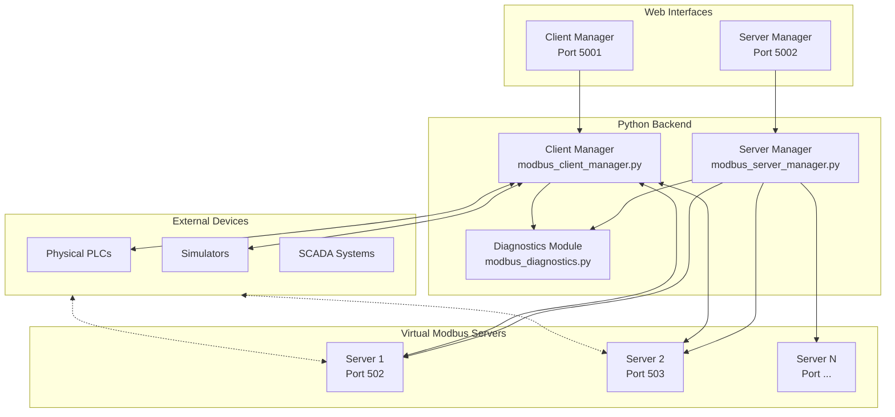

# Modbus TCP Client/Server Suite

A comprehensive Python-based Modbus TCP testing and simulation platform with modern web interfaces for industrial automation development, PLC communication testing, and protocol analysis.


## Overview

This project provides a complete Modbus TCP testing environment with:

- **Multi-Server Manager** - Create and manage multiple virtual Modbus TCP servers
- **Multi-Client Manager** - Connect to and interact with multiple Modbus devices
- **Protocol Diagnostics** - Deep packet inspection and timing analysis
- **Data Simulation** - Built-in waveform generators for realistic testing

Perfect for:
- PLC/SCADA development and testing
- Industrial protocol learning
- Integration testing without physical hardware
- Modbus communication debugging

---

## Architecture



---

## Screenshots

### Server Manager
Create and manage multiple Modbus TCP servers with configurable register spaces.


### Server Detail View
Monitor registers, configure simulations, and view diagnostics for each server.


### Client Manager
Connect to multiple Modbus devices and monitor/control registers.


---

## Key Features

### Server Management
| Feature | Description |
|---------|-------------|
| Multi-Server | Run multiple servers on different ports simultaneously |
| Register Types | Holding registers, input registers, coils, discrete inputs |
| Simulations | Sine, ramp, random, and square wave generators |
| Real-time Monitoring | Live register value updates |
| Configuration Persistence | Save/load server configurations |

### Client Capabilities
| Feature | Description |
|---------|-------------|
| Multi-Client | Connect to multiple servers simultaneously |
| Read/Write | Full read/write support for all register types |
| Polling | Configurable polling intervals for monitoring |
| Write Simulations | Automated write patterns for testing |
| Data Export | Export monitored data to CSV |

### Protocol Diagnostics
| Feature | Description |
|---------|-------------|
| Packet Capture | Full Modbus TCP packet logging |
| MBAP Parsing | Header and PDU field analysis |
| Timing Analysis | Min/max/average response times |
| Hex Visualization | Raw packet inspection |

---

## Technical Stack

- **Backend**: Python 3.8+, Flask
- **Modbus Library**: pymodbus 3.11+
- **Frontend**: HTML5, CSS3, JavaScript
- **Data Format**: JSON configuration files
- **Deployment**: Docker support, standalone executables

---

## API Overview

RESTful API for programmatic control and MCP tool integration.

### Server API (Port 5002)
```
GET    /api/servers                    - List all servers
POST   /api/servers                    - Create server
DELETE /api/servers/<id>               - Delete server
POST   /api/servers/<id>/start         - Start server
POST   /api/servers/<id>/stop          - Stop server
GET    /api/servers/<id>/registers     - Read registers
POST   /api/servers/<id>/registers     - Write registers
```

### Client API (Port 5001)
```
GET    /api/clients                    - List all clients
POST   /api/clients                    - Create client
POST   /api/clients/<id>/connect       - Connect to server
POST   /api/clients/<id>/disconnect    - Disconnect
POST   /api/clients/<id>/read          - Read registers
POST   /api/clients/<id>/write         - Write registers
GET    /api/clients/<id>/export/csv    - Export data
```

---

## Simulation Types

Both server and client support automated data simulation:

| Type | Description | Use Case |
|------|-------------|----------|
| `sine` | Sinusoidal wave (0-65535) | Analog sensor simulation |
| `ramp` | Linear ramp with rollover | Counter/accumulator testing |
| `random` | Random values | Noise/variance testing |
| `square` | Square wave oscillation | Digital signal simulation |

---

## Use Cases

1. **PLC Development** - Test control logic without physical hardware
2. **SCADA Integration** - Verify communication before deployment
3. **Training** - Learn Modbus protocol in a safe environment
4. **Debugging** - Diagnose communication issues with packet analysis
5. **Load Testing** - Stress test with multiple simultaneous connections

---

## Author

**James Belcher**

- Industrial automation and controls engineer
- Specializing in PLC programming, SCADA systems, and protocol integration

---

## Source Code Availability

This repository contains documentation and screenshots only. Full source code is available upon request for:

- Prospective employers (interview/evaluation purposes)
- Collaboration opportunities
- Licensed commercial use

**Contact**: [Reach out via GitHub](https://github.com/fixstuff) or [LinkedIn](https://linkedin.com/in/jamesbelcher)

---

## Support

If you find this project interesting, consider supporting development:

[](https://www.patreon.com/c/u3944878)

---

## License

MIT License - Documentation and screenshots freely available.
Source code available under separate license upon request.
